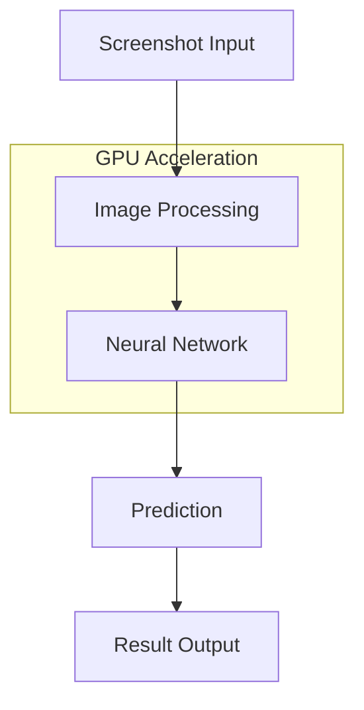

# AimGuardian AI Architecture

## System Overview

AimGuardian AI is built with a modular architecture that focuses on high performance, scalability, and maintainability. The system is designed to process game screenshots in real-time using GPU-accelerated deep learning.

## Core Components

### 1. Neural Network Module (`neural_network.py`)
- Custom CNN architecture
- GPU-optimized operations
- Mixed precision training
- Model checkpointing
- Inference optimization

### 2. Image Processing Module (`utils.py`)
- Screenshot preprocessing
- YUV color space conversion
- Contrast enhancement
- Batch processing
- GPU memory management

### 3. Training Pipeline (`train.py`)
- Data loading and augmentation
- Training loop
- Validation
- Model saving
- Performance monitoring

### 4. Prediction Pipeline (`predict.py`)
- Real-time inference
- Batch processing
- Result visualization
- Performance metrics

## Data Flow



## Model Architecture

### Feature Extraction
```
Input (224x224x3)
    │
    ▼
Conv Block 1 (32 filters)
    │
    ▼
Conv Block 2 (64 filters)
    │
    ▼
Conv Block 3 (128 filters)
    │
    ▼
Conv Block 4 (256 filters)
    │
    ▼
Conv Block 5 (512 filters)
    │
    ▼
Global Average Pooling
```

### Classification Head
```
Global Features
    │
    ▼
Dropout (0.5)
    │
    ▼
Dense Layer (512 → 256)
    │
    ▼
ReLU Activation
    │
    ▼
Dropout (0.3)
    │
    ▼
Output Layer (256 → 2)
```

## Performance Optimizations

### GPU Acceleration
- CUDA operations
- Mixed precision training
- Memory-efficient operations
- Non-blocking data transfers

### Image Processing
- YUV color space optimization
- Efficient resizing
- Batch processing
- Memory management

### Training Optimizations
- Dynamic batch sizing
- Learning rate scheduling
- Gradient scaling
- Early stopping

## Dependencies

### Core Dependencies
- PyTorch 2.0.1
- CUDA 11.7+
- OpenCV
- NumPy

### Development Dependencies
- Black
- Flake8
- Pytest
- Pre-commit

## Configuration

### Model Configuration
```python
MODEL_CONFIG = {
    'input_size': (224, 224),
    'batch_size': 32,
    'learning_rate': 0.001,
    'num_epochs': 100,
    'early_stopping': 10
}
```

### Training Configuration
```python
TRAINING_CONFIG = {
    'optimizer': 'AdamW',
    'scheduler': 'OneCycleLR',
    'mixed_precision': True,
    'gradient_clip': 1.0
}
```

## Security Considerations

1. Input Validation
   - Screenshot verification
   - Size limits
   - Format validation

2. Model Security
   - Weight verification
   - Input sanitization
   - Output validation

3. Performance Security
   - Memory limits
   - GPU resource management
   - Batch size limits

## Future Improvements

1. Architecture
   - Attention mechanisms
   - Transformer integration
   - Multi-scale processing

2. Performance
   - Distributed training
   - Model quantization
   - TensorRT optimization

3. Features
   - Real-time monitoring
   - Advanced visualization
   - API integration

## Development Guidelines

1. Code Structure
   - Modular design
   - Clear interfaces
   - Type hints
   - Documentation

2. Testing
   - Unit tests
   - Integration tests
   - Performance tests
   - Security tests

3. Documentation
   - Code comments
   - API documentation
   - Usage examples
   - Architecture diagrams 